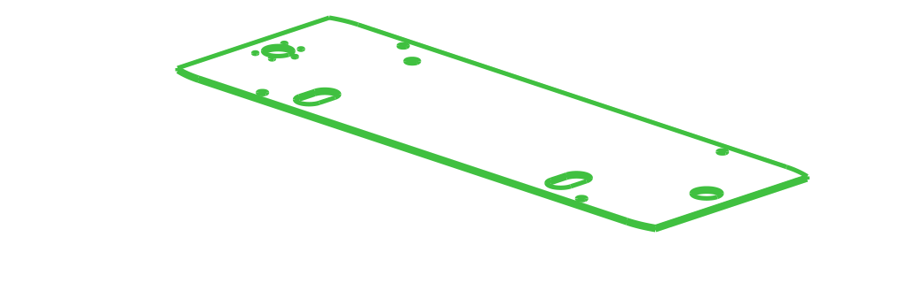
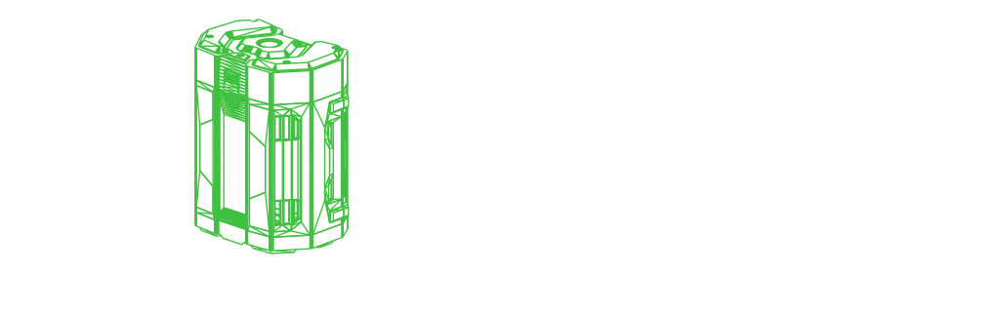
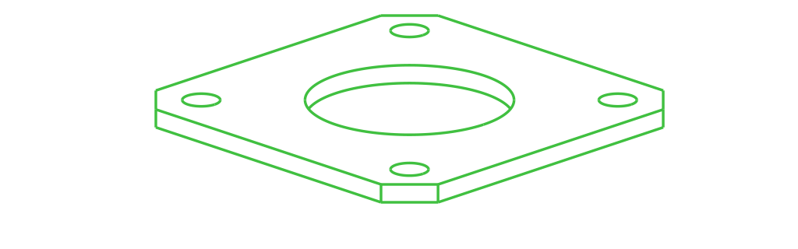
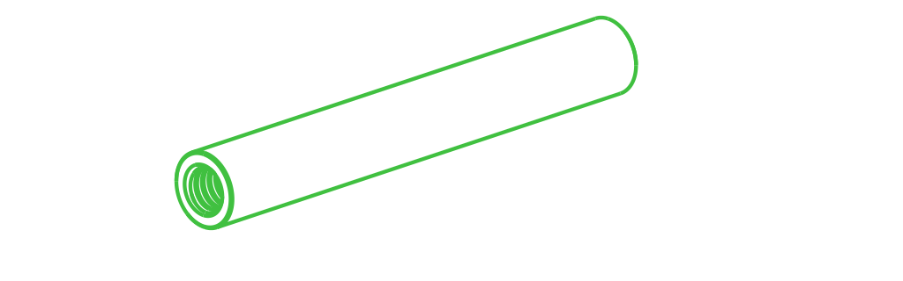
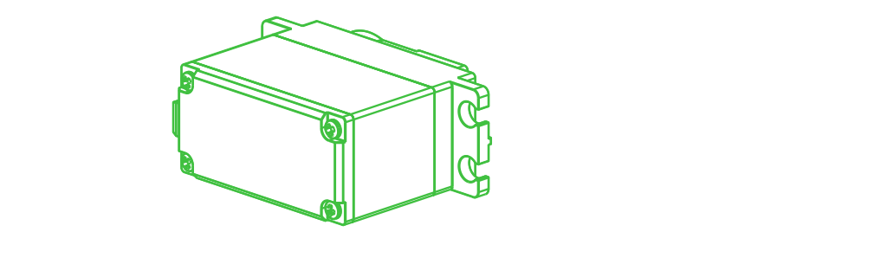
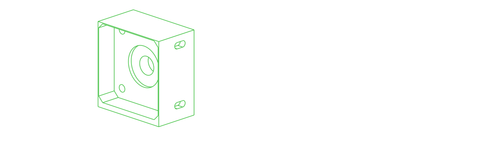

# Don1
## Bill of Materials
| Part | Count* | Vendor | SKU | Preview |
| -- | -- | -- | -- | -- |
| [Top board of Don1](../../../parts/custom/don1_board_top/README.md) | 1 | | |  |
| [Bottom board of Don1](../../../parts/custom/don1_board_bottom/README.md) | 1 | | |  |
| [Modbus RS485 Stepper Driver 1.0-5.6A 24-48VDC for Nema 17, 23, 24 Stepper Motor](../../../parts/stepperonline/driver-stepper-dm556rs/README.md) | 8 |stepperonline |[DM556RS](https://www.omc-stepperonline.com/modbus-rs485-stepper-driver-1-0-5-6a-24-48vdc-for-nema-17-23-24-stepper-motor-dm556rs) |  |
| [Cloudray Nema 23/24 Stepper Motor Driver DM556SX2 5.6A 24~48VDC for 2pcs Stepper Motor Controller CNC Engraving Machine](../../../parts/cloudray/driver-stepper-dm556sx2/README.md) | 4 |cloudray |[DM556SX2](https://www.aliexpress.us/item/3256802913709231.html) |  |
| [Digital Brushless DC Motor Driver 18V-50VDC Max 10A 200W](../../../parts/stepperonline/driver-brushless-bld510s/README.md) | 2 |stepperonline |[BLD-510S](https://www.omc-stepperonline.com/digital-brushless-dc-motor-driver-18v-50vdc-max-10a-200w-bld-510s) |  |
| [Part of the enclosure for electronic components](../../../parts/custom/enclosure-0/README.md) | 1 | | |  |
| [Part of the enclosure for electronic components](../../../parts/custom/enclosure-1/README.md) | 1 | | |  |
| [Part of the enclosure for electronic components](../../../parts/custom/enclosure-2/README.md) | 1 | | |  |
| [Part of the enclosure for electronic components](../../../parts/custom/enclosure-3/README.md) | 1 | | |  |
| [Part of the enclosure for electronic components](../../../parts/custom/enclosure-4/README.md) | 1 | | |  |
| [Part of the enclosure for electronic components](../../../parts/custom/enclosure-5/README.md) | 1 | | |  |
| [Part of the enclosure for electronic components](../../../parts/custom/enclosure-6/README.md) | 1 | | |  |
| [Part of the enclosure for electronic components](../../../parts/custom/enclosure-7/README.md) | 1 | | |  |
| [Intel NUC 12th gen board](../../../parts/intel/nuc12/README.md) | 2 |intel |[NUC12WSB](https://ark.intel.com/content/www/us/en/ark/products/121629/intel-nuc-12-pro-board-nuc12wsbv5.html) |  |
| [Raspberry Pi 4 Model B](../../../parts/raspberry-pi/rpi4b/README.md) | 1 |raspberry-pi |[PI4-8GB](https://www.canakit.com/raspberry-pi-4-8gb.html?cid=usd&src=raspberrypi) |  |
| [Arduino Mega 2560 Rev3](../../../parts/arduino/mega2560/README.md) | 1 |arduino |[A000067](https://store.arduino.cc/products/arduino-mega-2560-rev3) |  |
| [POWER+ 7.5 AMP HOUR BATTERY WITH FUEL GAUGE](../../../parts/ego/battery-7.5/README.md) | 1 |ego |[BA4200T](https://egopowerplus.com/battery-7-5amp-fuel-gauge/) |  |
| [1120 Series U-Channel (7 Hole, 192mm Length)](../../../parts/gobilda/structure-u-channel-7/README.md) | 10 |gobilda |[1120-0007-0192](https://www.gobilda.com/1120-series-u-channel-7-hole-192mm-length/) |  |
| [2313 Series Stainless Steel, MOD 1.25 Worm (8mm REX Bore, 33mm Length)](../../../parts/gobilda/motion-worm-8mmREX/README.md) | 3 |gobilda |[2313-4008-0033](https://www.gobilda.com/2313-series-stainless-steel-mod-1-25-worm-8mm-rex-bore-33mm-length/) |  |
| [1611 Series Flanged Ball Bearing (8mm REX ID x 14mm OD, 5mm Thickness) - 2 Pack](../../../parts/gobilda/motion-bearing-flanged-8mmREX/README.md) | 15 |gobilda |[1611-0514-4008](https://www.gobilda.com/1611-series-flanged-ball-bearing-8mm-rex-id-x-14mm-od-5mm-thickness-2-pack/) |  |
| [1500 Series Plastic Spacer (8mm ID x 10mm OD, 1mm Thickness) - 12 Pack](../../../parts/gobilda/hardware-spacer-plastic-8mm-1mm/README.md) | 3 |gobilda |[1500-0010-0008](https://www.gobilda.com/1500-series-plastic-spacer-8mm-id-x-10mm-od-1mm-thickness-12-pack/) |  |
| [1522 Series 8mm ID Spacer (10mm OD, 4mm Length) - 4 Pack](../../../parts/gobilda/hardware-spacer-steel-8mm-4mm/README.md) | 3 |gobilda |[1522-0010-0040](https://www.gobilda.com/1522-series-8mm-id-spacer-10mm-od-4mm-length-4-pack/) |  |
| [https://www.gobilda.com/2314-series-brass-mod-1-25-hub-mount-worm-gear-14mm-bore-28-tooth/](../../../parts/gobilda/motion-worm-gear-28t/README.md) | 3 |gobilda |[2314-0014-0028](https://www.gobilda.com/2314-series-brass-mod-1-25-hub-mount-worm-gear-14mm-bore-28-tooth/) |  |
| [1309 Series Sonic Hub (8mm REX Bore)](../../../parts/gobilda/motion-hub-sonic-8mmREX/README.md) | 17 |gobilda |[1309-0016-4008](https://www.gobilda.com/1309-series-sonic-hub-8mm-rex-bore/) |  |
| [2106 Series Stainless Steel REX Shaft (8mm Diameter, 72mm Length)](../../../parts/gobilda/motion-shaft-8mmREX-72mm/README.md) | 2 |gobilda |[2106-4008-0720](https://www.gobilda.com/2106-series-stainless-steel-rex-shaft-8mm-diameter-72mm-length/) |  |
| [2106 Series Stainless Steel REX Shaft (8mm Diameter) Clip](../../../parts/gobilda/motion-shaft-8mmREX-clip/README.md) | 4 | | |  |
| [2910 Series Aluminum Clamping Collar (8mm REX ID x 20mm OD, 9mm Length)](../../../parts/gobilda/motion-collar-clamping-8mmREX/README.md) | 8 |gobilda |[2910-0920-4008](https://www.gobilda.com/2910-series-aluminum-clamping-collar-8mm-rex-id-x-20mm-od-9mm-length/) |  |
| [2106 Series Stainless Steel REX Shaft (8mm Diameter, 64mm Length)](../../../parts/gobilda/motion-shaft-8mmREX-64mm/README.md) | 8 |gobilda |[2106-4008-0640](https://www.gobilda.com/2106-series-stainless-steel-rex-shaft-8mm-diameter-64mm-length/) |  |
| [1201 Series Quad Block Pattern Mount (43-2)](../../../parts/gobilda/structure-mount-quad-block/README.md) | 42 |gobilda |[1201-0043-0002](https://www.gobilda.com/1201-series-quad-block-pattern-mount-43-2/) |  |
| [8mm Pitch Acetal Hub-Mount Sprocket (14mm Bore, 16 Tooth)](../../../parts/gobilda/motion-sprocket-plastic-14mm-16t/README.md) | 10 |gobilda |[3311-0014-0016](https://www.gobilda.com/8mm-pitch-acetal-hub-mount-sprocket-14mm-bore-16-tooth/) |  |
| [P Series Nema 17 Stepper Motor 72Ncm/101.98oz.in with Electromagnetic Brake](../../../parts/stepperonline/nema17-stepper-brake-72Ncm/README.md) | 14 |stepperonline |[17BK05-07](https://www.omc-stepperonline.com/p-series-nema-17-stepper-motor-72ncm-101-98oz-in-with-electromagnetic-brake-17bk05-07) |  |
| [A pad to level the front side of Nema17 motors](../../../parts/custom/nema17-flush-pad/README.md) | 16 | | |  |
| [1601 Series Flanged Ball Bearing (5mm ID x 14mm OD, 5mm Thickness) - 2 Pack](../../../parts/gobilda/motion-bearing-flanged-5mm/README.md) | 4 |gobilda |[1611-0514-0005](https://www.gobilda.com/1601-series-flanged-ball-bearing-5mm-id-x-14mm-od-5mm-thickness-2-pack/) |  |
| [1500 Series Plastic Spacer (5mm ID x 7mm OD, 1mm Thickness) - 12 Pack](../../../parts/gobilda/hardware-spacer-plastic-5mm-1mm/README.md) | 1 |gobilda |[1500-0010-0005](https://www.gobilda.com/1500-series-plastic-spacer-5mm-id-x-7mm-od-1mm-thickness-12-pack/) |  |
| [1309 Series Sonic Hub (5mm Bore)](../../../parts/gobilda/motion-hub-sonic-5mm/README.md) | 8 |gobilda |[1309-0016-0005](https://www.gobilda.com/1309-series-sonic-hub-5mm-bore/) |  |
| [8mm Pitch Steel Hub-Mount Sprocket (14mm Bore, 14 Tooth)](../../../parts/gobilda/motion-sprocket-steel-14mm-14t/README.md) | 4 |gobilda |[3310-0014-0014](https://www.gobilda.com/8mm-pitch-steel-hub-mount-sprocket-14mm-bore-14-tooth/) |  |
| [Turntable of Don1](../../../parts/custom/don1_turntable/README.md) | 2 | | |  |
| [Hex attachment for turntables](../../../parts/custom/turntable_attachment_hex/README.md) | 2 | | |  |
| [1120 Series U-Channel (2 Hole, 72mm Length)](../../../parts/gobilda/structure-u-channel-2/README.md) | 6 |gobilda |[1120-0002-0072](https://www.gobilda.com/1120-series-u-channel-2-hole-72mm-length/) |  |
| [1121 Series Low-Side U-Channel (7 Hole, 192mm Length)](../../../parts/gobilda/structure-u-channel-low-7/README.md) | 4 |gobilda |[1121-0007-0192](https://www.gobilda.com/1121-series-low-side-u-channel-7-hole-192mm-length/) |  |
| [A mount for NEMA-17 motors to be installed in a 48mm openning](../../../parts/custom/nema17-mount-wide/README.md) | 2 | | |  |
| [MG Series Planetary Gearbox Gear Ratio 100:1 Backlash 50 arc-min for Nema 17 Stepper Motor](../../../parts/stepperonline/nema17-gearbox-planetary-100/README.md) | 2 |stepperonline |[MG17-G100](https://www.omc-stepperonline.com/mg-series-planetary-gearbox-gear-ratio-100-1-backlash-50-arc-min-for-nema-17-stepper-motor-mg17-g100) |  |
| [4007 Series Hyper Coupler (8mm Round Bore to 8mm REX Bore)](../../../parts/gobilda/motion-coupler-hyper-8mm-8mmREX/README.md) | 6 |gobilda |[4007-0008-4008](https://www.gobilda.com/4007-series-hyper-coupler-8mm-round-bore-to-8mm-rex-bore/) |  |
| [1120 Series U-Channel (9 Hole, 240mm Length)](../../../parts/gobilda/structure-u-channel-9/README.md) | 8 |gobilda |[1120-0009-0240](https://www.gobilda.com/1120-series-u-channel-9-hole-240mm-length/) |  |
| [1501 Series M4 x 0.7mm Standoff (6mm OD, 43mm Length) - 4 Pack](../../../parts/gobilda/structure-standoff-m4-43mm/README.md) | 4 |gobilda |[1501-0006-0430](https://www.gobilda.com/1501-series-m4-x-0-7mm-standoff-6mm-od-43mm-length-4-pack/) |  |
| [Rubber Wheel 136×24mm](../../../parts/dfrobot/rubber-wheel/README.md) | 6 |dfrobot |[KIT0044](https://www.dfrobot.com/product-1006.html) |  |
| [1310 Series Hyper Hub (8mm REX Bore)](../../../parts/gobilda/motion-hub-hyper-8mmREX/README.md) | 6 |gobilda |[1310-0016-4008](https://www.gobilda.com/1310-series-hyper-hub-8mm-rex-bore/) |  |
| [2101 Series Stainless Steel D-Shaft (6mm Diameter, 70mm Length)](../../../parts/gobilda/motion-shaft-6mmD-70mm/README.md) | 6 |gobilda |[2101-0006-0070](https://www.gobilda.com/2101-series-stainless-steel-d-shaft-6mm-diameter-70mm-length/) |  |
| [1802 Series Servo Frame (43mm Width, for Standard Size Servos)](../../../parts/gobilda/structure-mount-servo-43mm-std/README.md) | 12 |gobilda |[1802-0043-0001](https://www.gobilda.com/1802-series-servo-frame-43mm-width-for-standard-size-servos/) |  |
| [Hitec HS-488HB Servo](../../../parts/gobilda/motion-servo-hs-488hb/README.md) | 12 |gobilda |[33488](https://www.gobilda.com/hitec-hs-488hb-servo/) |  |
| [1611 Series Flanged Ball Bearing (6mm ID x 14mm OD, 5mm Thickness) - 2 Pack](../../../parts/gobilda/motion-bearing-flanged-6mm/README.md) | 6 |gobilda |[1611-0514-0006](https://www.gobilda.com/1611-series-flanged-ball-bearing-6mm-id-x-14mm-od-5mm-thickness-2-pack/) |  |
| [2920 Series Steel Set-Screw Collar (6mm Bore) - 2 Pack](../../../parts/gobilda/motion-collar-set-6mm/README.md) | 2 |gobilda |[2920-0001-0006](https://www.gobilda.com/2920-series-steel-set-screw-collar-6mm-bore-2-pack/) |  |
| [1106 Series Square Beam (15 Hole, 120mm Length)](../../../parts/gobilda/structure-beam-15/README.md) | 4 |gobilda |[1106-0015-0120](https://www.gobilda.com/1106-series-square-beam-15-hole-120mm-length/) |  |
| [1906 Series Low-Profile Servo Hub (25 Tooth Spline, 32mm Diameter)](../../../parts/gobilda/motion-servo-attach-hub-low-25t/README.md) | 4 |gobilda |[1906-0025-0032](https://www.gobilda.com/1906-series-low-profile-servo-hub-25-tooth-spline-32mm-diameter/) |  |
| [1900 Series Single Servo Arm (25 Tooth Spline, 32mm Length)](../../../parts/gobilda/motion-servo-attach-arm-25t/README.md) | 4 |gobilda |[1900-0025-0104](https://www.gobilda.com/1900-series-single-servo-arm-25-tooth-spline-32mm-length/) |  |
| [1121 Series Low-Side U-Channel (3 Hole, 96mm Length)](../../../parts/gobilda/structure-u-channel-low-3/README.md) | 4 |gobilda |[1121-0003-0096](https://www.gobilda.com/1121-series-low-side-u-channel-3-hole-96mm-length/) |  |
| [1120 Series U-Channel (5 Hole, 144mm Length)](../../../parts/gobilda/structure-u-channel-5/README.md) | 8 |gobilda |[1120-0005-0144](https://www.gobilda.com/1120-series-u-channel-5-hole-144mm-length/) |  |
| [1108 Series Flat Pattern Bracket (2-3)](../../../parts/gobilda/structure-bracket-flat-2-3/README.md) | 16 |gobilda |[1108-0002-0003](https://www.gobilda.com/1108-series-flat-pattern-bracket-2-3/) |  |
| [2106 Series Stainless Steel REX Shaft (8mm Diameter, 56mm Length)](../../../parts/gobilda/motion-shaft-8mmREX-56mm/README.md) | 4 |gobilda |[2106-4008-0560](https://www.gobilda.com/2106-series-stainless-steel-rex-shaft-8mm-diameter-56mm-length/) |  |
| [A mount for NEMA-17 motors to be installed inside of a 48mm channel (43mm inner dimension)](../../../parts/custom/nema17-mount/README.md) | 4 | | |  |
| [MG Series Planetary Gearbox Gear Ratio 10:1 Backlash 30 arc-min for Nema 17 Stepper Motor](../../../parts/stepperonline/nema17-gearbox-planetary-10/README.md) | 4 |stepperonline |[MG17-G10](https://www.omc-stepperonline.com/mg-series-planetary-gearbox-gear-ratio-10-1-backlash-30-arc-min-for-nema-17-stepper-motor-mg17-g10) |  |
| [2106 Series Stainless Steel REX Shaft (8mm Diameter, 80mm Length)](../../../parts/gobilda/motion-shaft-8mmREX-80mm/README.md) | 4 |gobilda |[2106-4008-0800](https://www.gobilda.com/2106-series-stainless-steel-rex-shaft-8mm-diameter-80mm-length/) |  |
| [A foot to walk on or a hand to grab with](../../../parts/custom/hook/README.md) | 4 | | |  |
| [1108 Series Flat Pattern Bracket (1-2)](../../../parts/gobilda/structure-bracket-flat-1-2/README.md) | 8 |gobilda |[1108-0001-0002](https://www.gobilda.com/1108-series-flat-pattern-bracket-1-2/) |  |
| [2811 Series Zinc-Plated Steel Hex Nut (M4 x 0.7mm, 7mm Hex) - 25 Pack](../../../parts/gobilda/hardware-nut-m4-0.7mm/README.md) | 1 |gobilda |[2811-0004-0007](https://www.gobilda.com/2811-series-zinc-plated-steel-hex-nut-m4-x-0-7mm-7mm-hex-25-pack/) |  |
| [Steel Channel-Connector Plate - 2 Pack](../../../parts/gobilda/hardware-plate-channel-conn/README.md) | 4 |gobilda |[2803-0039-0022](https://www.gobilda.com/steel-channel-connector-plate-2-pack/) |  |

(\*) The `Count` field is the number of SKUs to be ordered.
It already takes into account the number of items per SKU.
            