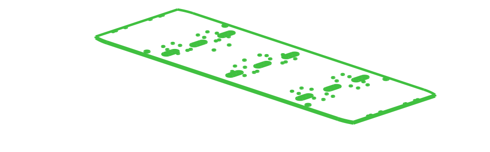

# Don1
## Bill of Materials
| Part | Count | Vendor | SKU | Preview |
| -- | -- | -- | -- | -- |
| [Don1_Top_Board](../../.././parts/custom/don1_board_top/README.md) | 1 | | |  |
| [Don1_Bottom_Board](../../.././parts/custom/don1_board_bottom/README.md) | 1 | | |  |
| [1120 Series U-Channel (7 Hole, 192mm Length)](../../.././parts/gobilda/structure-u-channel-7/README.md) | 10 |gobilda |[1120-0007-0192](https://www.gobilda.com/1120-series-u-channel-7-hole-192mm-length/) |  |
| [P Series Nema 17 Stepper Motor 72Ncm/101.98oz.in with Electromagnetic Brake](../../.././parts/stepperonline/nema17-stepper-brake-72Ncm/README.md) | 2 |stepperonline |[17BK05-07](https://www.omc-stepperonline.com/p-series-nema-17-stepper-motor-72ncm-101-98oz-in-with-electromagnetic-brake-17bk05-07) |  |
| [1120 Series U-Channel (2 Hole, 72mm Length)](../../.././parts/gobilda/structure-u-channel-2/README.md) | 6 |gobilda |[1120-0002-0072](https://www.gobilda.com/1120-series-u-channel-2-hole-72mm-length/) |  |
| [1121 Series Low-Side U-Channel (7 Hole, 192mm Length)](../../.././parts/gobilda/structure-u-channel-low-7/README.md) | 4 |gobilda |[1121-0007-0192](https://www.gobilda.com/1121-series-low-side-u-channel-7-hole-192mm-length/) |  |
| [1120 Series U-Channel (9 Hole, 240mm Length)](../../.././parts/gobilda/structure-u-channel-9/README.md) | 8 |gobilda |[1120-0009-0240](https://www.gobilda.com/1120-series-u-channel-9-hole-240mm-length/) |  |
| [1120 Series U-Channel (5 Hole, 144mm Length)](../../.././parts/gobilda/structure-u-channel-5/README.md) | 8 |gobilda |[1120-0005-0144](https://www.gobilda.com/1120-series-u-channel-5-hole-144mm-length/) |  |
