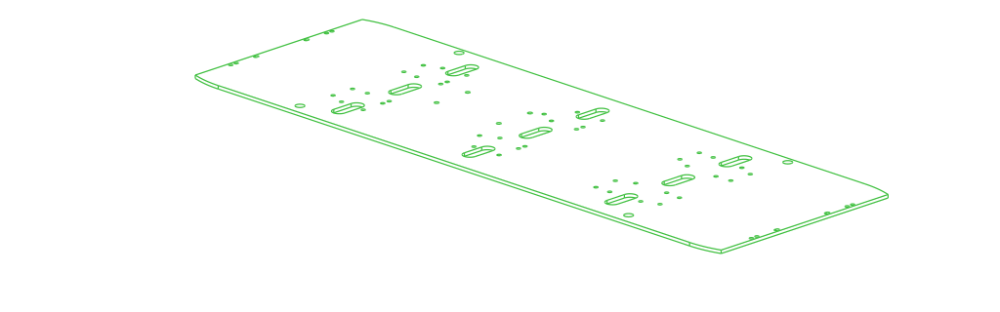
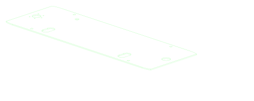

# OpenVMP Parts

The below are the parts used by at least some OpenVMP robot.

See the bill of materials to learn which parts are required for which robot.

## Custom

The folder [custom](./custom/) conatins parts that are OpenVMP specific.

| Part                                             | Image                                                                                                                                                |
| ------------------------------------------------ | ---------------------------------------------------------------------------------------------------------------------------------------------------- |
| [Don1 bottom board](./custom/don1_board_bottom/) |  |
| [Don1 top board](./custom/don1_board_top/)       |        |

## Market

The folder [market](./market/) conatins parts that can be purchased from
e-commerce platforms (Amazon, AliExpress etc).

## goBILDA

The folder [gobilda](./gobilda/) contains parts that can be purchased from
[goBILDA](https://gobilda.com/).

## STEPPERONLINE

The folder [stepperonline](./stepperonline/) contains parts that can be purchased from
[STEPPERONLINE](https://stepperonline.com/).
