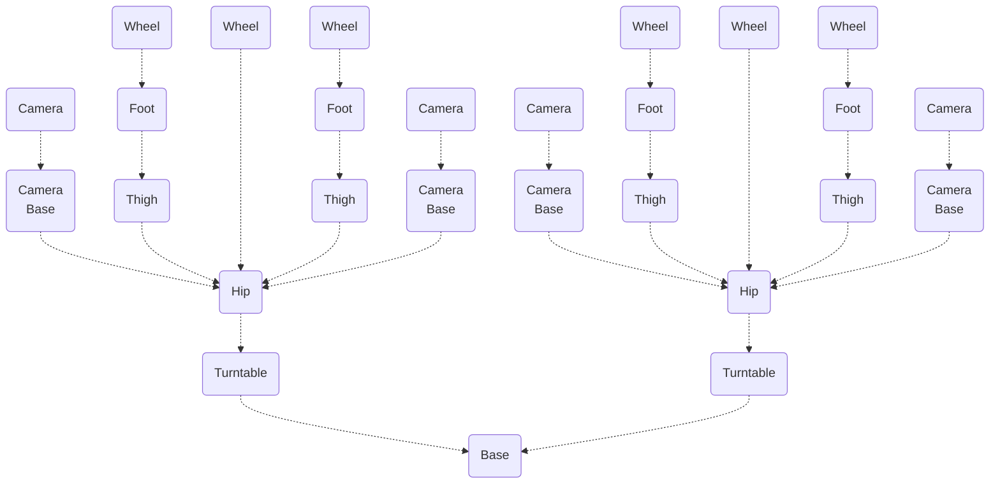

# Don1

This robot is smart, powerful and large (>1m long). It's made of goBILDA components, some off-the-shelf stainless steel sheets and 3D printed parts.
The bill of materials can be found [here](../../generated_files/robots/don1/bom.md).

It is designed to perform tasks on its own. But it also has enough computing power to control a fleet of smaller OpenVMP robots.

## High Level Architecture

The robot modules are separated from each other by 1 degree of freedom.

## Modules

### Base

The base of the robot is where the battery and most of electronics are.
It has coupled motors to turn front and rear sides of the robot using turntables.

 

### Turntable

There is a turntable on each side of the robot.
It's being turned left and right by the base.
Turntable itself rotates the hip around it's center axle.

 

### Hip

The hip is connected to the turntable.
Each hip has a passive (no motor) wheel in the center and two thighs attached on each side.
It also has two camera bases attached on each side.
The only motors it has are servos to turn cameras and connect/disconnect mechanisms.

 

### Thigh

The thigh has motors to both turn itself and to bend the knee.

 

### Foot

The foot has a motor to drive the wheel.
It also has mechanical parts to aid various ways of movement:
pushing, grabbing etc.

 

### Camera Base

This is the lower moving part of the camera assembly.
It hosts the second servo that adds the second degree of freedom to the camera.

 

### Camera

This is the housing for the stereo camera assembly.

 

### Wheel

This wheel provides the grip the robot needs to climb up.
