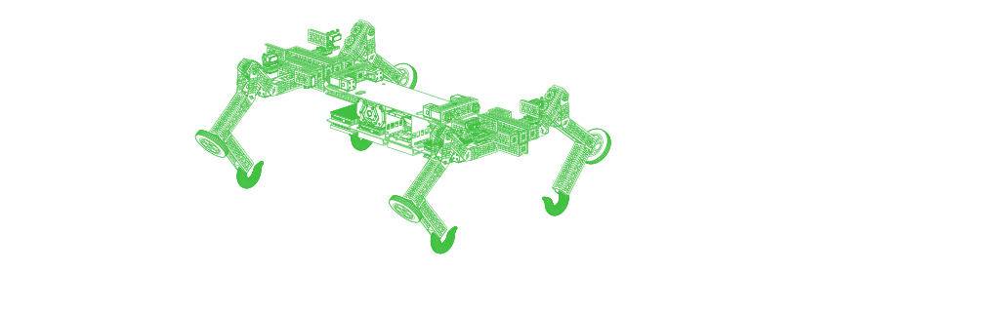
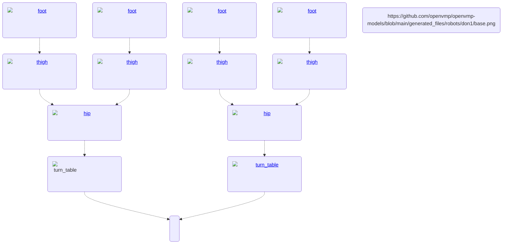

# Don1

This robot is smart, powerful and large (>1m long). It's made of goBILDA components, some off-the-shelf stainless steel sheets and 3D printed parts.
The bill of materials can be found [here](../../generated_files/robots/don1/bom.md).

It is designed to perform tasks on its own. But it also has enough computing power to control a fleet of smaller OpenVMP robots.

## High Level Architecture

The major modules are separated from each other by 1 degree of freedom.

## Modules

### Base

The base of the robot is where the battery and computers are.
It has coupled motors to turn front and rear sides using turntables to left and right.

### Turntable

Turntable is on each side of the robot to rotate the hip around it's own axle.

### Hip

The hip is connected to the turntable. Thighs are attached to each side.
It only has motors to turn cameras and connect/disconnect mechanisms.

### Thigh

The thigh has motors to both turn itself and to bend the knee.

### Foot

The foot has a motor to drive the wheel.
It also has mechanical parts to aid various ways of movement:
pushing, grabbing etc.
